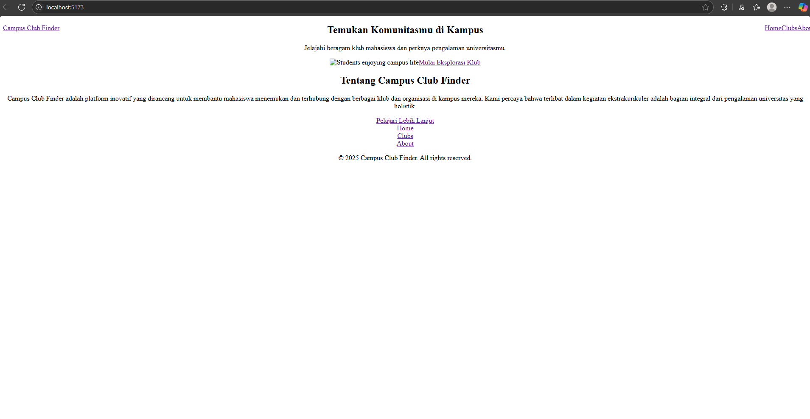

# Campus Club Finder


*(Ganti URL ini dengan path ke screenshot halaman beranda Anda, pastikan file gambar sudah diunggah di `public/images/` atau folder lain yang relevan di repo Anda)*

Sebuah aplikasi web satu halaman (SPA) yang dibangun untuk membantu mahasiswa dengan mudah menemukan dan menjelajahi berbagai klub dan organisasi yang tersedia di kampus mereka. Aplikasi ini menyediakan daftar klub, detail lengkap untuk setiap klub, dan fungsionalitas pencarian untuk menemukan klub yang diminati.

## Daftar Isi

- [Fitur Utama](#fitur-utama)
- [Demo Aplikasi](#demo-aplikasi)
- [Teknologi yang Digunakan](#teknologi-yang-digunakan)
- [Cara Menjalankan Proyek Secara Lokal](#cara-menjalankan-proyek-secara-lokal)
  - [Prasyarat](#prasyarat)
  - [Instalasi](#instalasi)
- [Struktur Proyek](#struktur-proyek)
- [Kontribusi](#kontribusi)
- [Lisensi](#lisensi)

---

## Fitur Utama

* **Daftar Klub Komprehensif:** Menampilkan semua klub yang tersedia dalam format kartu yang menarik.
* **Halaman Detail Klub:** Informasi lengkap tentang setiap klub, termasuk deskripsi, gambar, dan daftar acara mendatang.
* **Pencarian Interaktif:** Filter klub secara *real-time* berdasarkan nama atau deskripsi singkat.
* **Navigasi Intuitif:** Menggunakan React Router DOM untuk navigasi halaman yang lancar dan responsif.
* **Desain Responsif:** Antarmuka pengguna yang dioptimalkan untuk berbagai ukuran layar (mobile, tablet, desktop) dengan Tailwind CSS.
* **Halaman Tentang Kami:** Informasi mengenai tujuan dan visi aplikasi.
* **Penanganan Halaman 404:** Pesan yang ramah pengguna untuk rute yang tidak ditemukan.


## Teknologi yang Digunakan

* **[React](https://react.dev/)**: Library JavaScript populer untuk membangun antarmuka pengguna interaktif.
* **[Vite](https://vitejs.dev/)**: *Build tool* generasi berikutnya untuk pengembangan web frontend yang sangat cepat.
* **[Tailwind CSS](https://tailwindcss.com/)**: *Framework* CSS *utility-first* untuk styling yang cepat, konsisten, dan fleksibel.
* **[React Router DOM](https://reactrouter.com/en/main)**: Kumpulan komponen navigasi deklaratif untuk React.
* **JavaScript (ES6+)**: Bahasa pemrograman utama.
* **HTML5 & CSS3**: Untuk struktur dan gaya dasar web.

---

## Cara Menjalankan Proyek Secara Lokal

Ikuti langkah-langkah di bawah ini untuk mendapatkan salinan proyek yang berjalan di mesin lokal Anda.

### Prasyarat

Pastikan Anda telah menginstal **[Node.js](https://nodejs.org/)** (versi LTS direkomendasikan) di sistem Anda. Ini akan secara otomatis menginstal `npm` (Node Package Manager).

### Instalasi

1.  **Clone repositori ini:**
    Buka terminal atau command prompt Anda dan jalankan perintah berikut:
    ```bash
    git clone [https://github.com/geellank/campus-club-finder.git](https://github.com/geellank/campus-club-finder.git)
    ```

2.  **Masuk ke direktori proyek:**
    ```bash
    cd campus-club-finder
    ```

3.  **Instal dependensi:**
    Aplikasi ini menggunakan berbagai pustaka dan paket yang perlu diinstal.
    ```bash
    npm install
    ```

4.  **Jalankan aplikasi dalam mode pengembangan:**
    Setelah semua dependensi terinstal, Anda bisa menjalankan aplikasi:
    ```bash
    npm run dev
    ```
    Aplikasi akan berjalan di `http://localhost:5173/` (atau port lain yang tersedia jika 5173 sudah digunakan). Buka URL ini di browser web Anda untuk melihat aplikasi beraksi.

---

## Struktur Proyek

Berikut adalah gambaran umum struktur direktori utama proyek:
